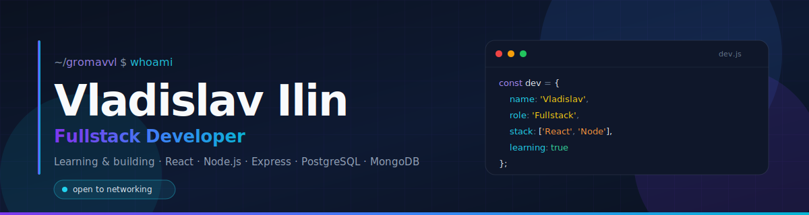

<!--
  GitHub README · Владислав Ильин (@GromavVL)
-->

  

<h1 align="center">Привет! I'm Владислав Ильин 👋</h1>

  <b>Fullstack Developer</b> · learning, building, and shipping modern web apps.

  
  
  

---

## 🧭 About me

- 💻 Fullstack developer working across **React** on the front and **Node.js / Express** on the back.
- 🗄️ Comfortable with both **SQL** (PostgreSQL) and **NoSQL** (MongoDB) data layers.
- 📚 **Currently learning** — going deeper into backend architecture, databases, and system design.
- 🎯 I care about clean code, performance, and pixel-perfect interfaces.
- 🤝 Always happy to **connect, network, and exchange ideas** with other devs.

---

## 🛠️ Tech Stack

### 🎨 Frontend

  
  
  
  
  
  

### ⚙️ Backend

  
  
  

### 🗄️ Databases

  
  

### 🧰 Tools & Platform

  
  
  
  
  
  

---

## 📊 GitHub Stats

  
  

  

---

## 🚀 Currently learning

- 🌱 Going deeper into **Node.js + Express** patterns and clean backend architecture.
- 🐘 Mastering **PostgreSQL** — schemas, joins, indexes, query performance.
- 🍃 Exploring **MongoDB** for document-based projects and the **MERN** stack.
- 🧪 Practicing testing, authentication flows, and deployment workflows.

---

## 📫 Let's connect

  <a href="https://t.me/Gromav"><b>Telegram →</b> @Gromav</a> 
  <a href="https://www.linkedin.com/in/владислав-ильин-39b498381"><b>LinkedIn →</b> Владислав Ильин</a>

---

  <i>"Clean code advocate. Always learning."</i>

  

# README.md
